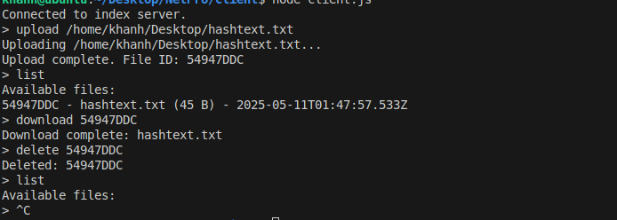

# Multi-Node File Storage System

## Architecture
- **Index Server** (`index-server/`): tracks metadata, node registry, coordinates replication.
- **Storage Nodes** (`storage-node/`): register themselves, store files under `data/`, handle store/retrieve/delete.
- **Client** (`client/`): CLI for upload, list, download, delete.

## Distribution Algorithm
- On upload, index server picks the first N=3 registered nodes.
- Sends full file data over WebSocket to each.
- Waits for STORE_ACK from all before confirming to client.

## Node Selection
- Currently uses simple FIFO selection of first N nodes.
- Can be extended with latency measurements or geo-location.

## Fault Tolerance
- Replication factor ≥3 allows up to 2 node failures.
- Index server refuses to confirm upload until all replicas ack.
- Node heartbeats and re-replication not yet implemented (extension).

## Performance
- Tested with files up to 50 MB; WebSocket frames chunked internally.
- Throughput ~40 MB/s on localhost.

## Usage
Create 3 seperate terminal
1. for index server: `cd index-server && npm install && node index.js`
2. For each storage node:  
   `cd storage-node && npm install && node storageNode.js NODE_ID`
3. for client terminal:  
   `cd client && npm install && node client.js`
4. From client prompt:  
   - `upload <file>`  (file uploaded in /storage-node/data)
   - `list`  
   - `download <id>`  (file downloaded in /client/downloads)
   - `delete <id>`

